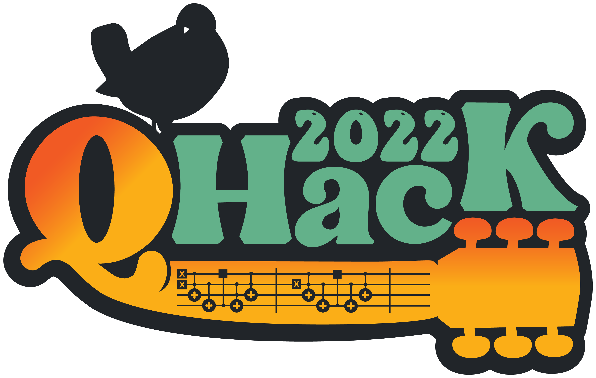
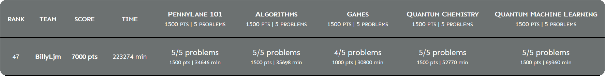

  
  
## Introduction  
Hi, these are my solutions to the [QHack 2022](https://qhack.ai) quantum machine learning hackathon.  
Everything is coded in Xanadu's [PennyLane](https://pennylane.readthedocs.io) quantum programming package.  
The original repo with all the hackathon details can be found at [/XanaduAI/QHack2022](https://github.com/XanaduAI/QHack2022).  
  
## Hackathon Details  
__Site:__ [QHack.ai](https://qhack.ai)  
__Date:__ February 2022  
  
## Score  
Here is a screenshot of my completed hackathon scoreboard entry.  
I ranked 47<sup>th</sup> in terms of cumulative completion time for the problem sets.  
  
I couldn't figure out `games_500_switches` using just a single shot, and so didn't get those points.  
Instead, my circuit has to be repeated until the ancilla qubit measures as a `1`, which has a 50% chance of occurring.  
  
## Files  
The `Coding_Challenges` folder contains all the problem statements and solutions.  
There is a `requirements.txt` to install the necessary python packages.  
Each problem set is in its own sub-folder with the name `<topic>_<score>_template`.  
In each problem set, there is a `.pdf` problem statement and a `.py` solution.  
There are also given test input `.in` and answers `.ans` with can be invoked in terminal via  
```console  
>> python <problem name>_template.py < 1.in  
```  
  
  
## Topics  
 * Pennylane Language  
     1. [`pennylane101_100_OrderMatters`](Coding_Challenges/pennylane101_100_OrderMatters_template) - Quantum Gates  
     2. [`pennylane101_200_KnowYourDevices`](Coding_Challenges/pennylane101_200_KnowYourDevices_template) - Pure & Mixed State Simulator/Device  
     3. [`pennylane101_300_superdense_coding`](Coding_Challenges/pennylane101_300_superdense_coding_template) - Superdense Coding  
     4. [`pennylane101_400_FiniteDifferenceGradient`](Coding_Challenges/pennylane101_400_FiniteDifferenceGradient_template) - Pennylane's Finite Difference Gradient  
     5. [`pennylane101_500_BitflipErrorCode`](Coding_Challenges/pennylane101_500_BitflipErrorCode_template) - Repetition Code  
 * Quantum Algorithms  
     1. [`algorithms_100_DeutschJozsa`](Coding_Challenges/algorithms_100_DeutschJozsa_template) - Deutsch-Jozsa Algorithm  
     2. [`algorithms_200_AdaptingTopology`](Coding_Challenges/algorithms_200_AdaptingTopology_template) - Hardware Topology/Connectivity  
     3. [`algorithms_300_AdderQFT`](Coding_Challenges/algorithms_300_AdderQFT_template) - Draper QFT Adder  
     4. [`algorithms_400_QuantumCounting`](Coding_Challenges/algorithms_400_QuantumCounting_template) - Grover's Algorithm  
     5. [`algorithms_500_DeutschJozsaStrikesAgain`](Coding_Challenges/algorithms_500_DeutschJozsaStrikesAgain) - Advanced Deutsch-Jozsa Algorithm  
 * Games  
     1. [`games_100_TardigradeMasquerade`](Coding_Challenges/games_100_TardigradeMasquerade_template) - Entanglement Entropy  
     2. [`games_200_CHSH`](Coding_Challenges/games_200_CHSH_template) - CHSH Game  
     3. [`games_300_Elitzur_Vaidman`](Coding_Challenges/games_300_Elitzur_Vaidman_template) - Elitzur-Vaidman Bomb Tester  
     4. [`games_400_FindTheCar`](Coding_Challenges/games_400_FindTheCar_template) - Monty Hall Problem  
     5. [`games_500_switches`](Coding_Challenges/games_500_switches_template) - 3 Switches Problem  
 * Quantum Chemistry  
     1. [`qchem_100_IsParticlePreserving`](Coding_Challenges/qchem_100_IsParticlePreserving_template) - Particle Preserving  
     2. [`qchem_200_OptimizingMeasurements`](Coding_Challenges/qchem_200_OptimizingMeasurements_template) - Combining Circuit Measurements  
     3. [`qchem_300_Universality_Givens`](Coding_Challenges/qchem_300_Universality_Givens_template) - Givens Rotation (for 1/2 excitations)  
     4. [`qchem_400_TripleGivens`](Coding_Challenges/qchem_400_TripleGivens_template) - Givens Rotation (for 3 excitations)  
     5. [`qchem_500_MindTheGap`](Coding_Challenges/qchem_500_MindTheGap_template) - Hydrogen's 1st Excited State  
 * Quantum Machine Learning  
     1. [`qml_100_GeneratingFourierState`](Coding_Challenges/qml_100_GeneratingFourierState_template) - Quantum Fourier Transform  
     2. [`qml_200_WhoLikesTheBeatles`](Coding_Challenges/qml_200_WhoLikesTheBeatles_template) - Quantum State Overlap  
     3. [`qml_300_IsingOnTheCake`](Coding_Challenges/qml_300_IsingOnTheCake_template) - Variational Quantum Classifier  
     4. [`qml_400_BuildingQRAM`](Coding_Challenges/qml_400_BuildingQRAM_template) - Quantum RAM  
     5. [`qml_500_UDMIS`](Coding_Challenges/qml_500_UDMIS_template) - Unit Disk Maximum Independent Set  